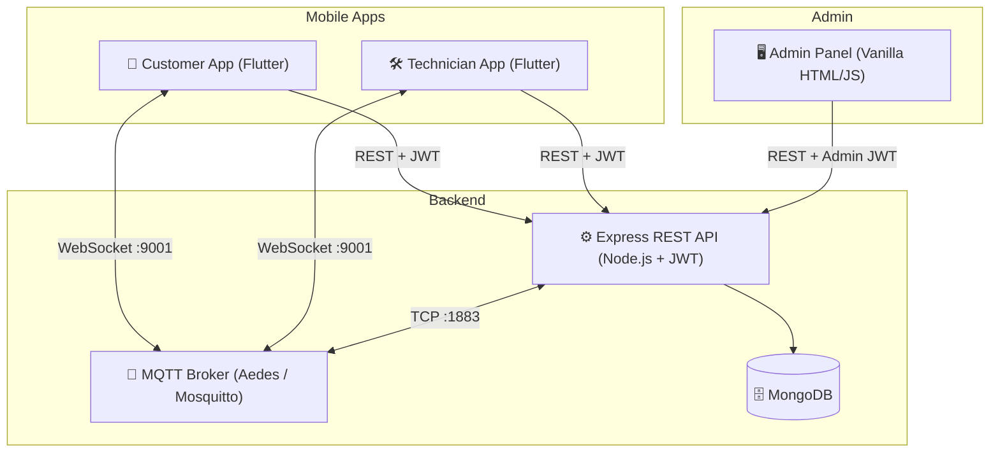

# 🔧 Fix-N-Go

> **On-demand mobile device repair platform** — connecting customers to certified field technicians in real time.

Fix-N-Go is a full-stack monorepo featuring a **Flutter Customer App**, a **Flutter Technician App**, a **Node.js/Express REST API**, a **web-based Admin Dashboard**, and real-time messaging powered by **MQTT**.

---

## 📁 Project Structure

```
fixngo/
├── apps/
│   ├── customer_app/          # Flutter Customer App
│   ├── technician_app/        # Flutter Technician (Fixer) App
│   └── admin_panel/           # Web Admin Dashboard (served at /admin)
├── backend/                   # Node.js + Express + MongoDB API
│   ├── src/
│   │   ├── config/            # DB config
│   │   ├── controllers/       # Route handlers
│   │   ├── middleware/        # Auth, error handling
│   │   ├── models/            # Mongoose schemas
│   │   ├── routes/            # API route definitions
│   │   ├── scripts/           # Seed, admin creation, MQTT broker
│   │   ├── tests/             # Jest integration tests
│   │   ├── utils/             # MQTT service, helpers
│   │   └── server.js          # App entry point
│   ├── .env.example
│   ├── API_DOCUMENTATION.md
│   └── Dockerfile
├── infrastructure/
│   ├── docker-compose.yml     # Mosquitto + TileServer
│   ├── mosquitto/             # MQTT broker config
│   └── nginx/                 # Reverse proxy config
├── docs/
│   └── architecture.md
└── uploads/                   # KYC & profile photo storage
```

---

## 🏗️ Architecture Overview



### Real-Time Communication (MQTT Topics)

| Direction | Topic | Purpose |
|---|---|---|
| Client → Server | `client/user/:id/online` | User presence heartbeat |
| Client → Server | `client/user/:id/offline` | User disconnect signal |
| Client → Server | `client/user/:id/location` | GPS location stream (throttled 5s) |
| Client → Server | `client/order/:id/status` | Order status update |
| Client → Server | `client/chat/message` | In-app chat message |
| Server → Client | `server/order/:id/updated` | Order change broadcast |
| Server → Client | `server/order/:id/location` | Technician live location |
| Server → Client | `server/user/:id/notification` | Push notification |
| Server → Client | `server/chat/:recipientId` | Direct message delivery |

---

## 🧩 Data Models

| Model | Description |
|---|---|
| `User` | Customer, Technician, or Admin — role-based |
| `Order` | Booking with device, issues, status, technician assignment |
| `Service` | Repair catalog with pricing |
| `Message` | Chat messages linked to orders |
| `Notification` | In-app push notification store |
| `Payment` | Payment intents and confirmations |
| `Rating` | Customer ratings with sub-categories |
| `WalletTransaction` | Technician earnings ledger |
| `Withdrawal` | Technician payout requests |
| `SupportTicket` | In-app support conversations |
| `OTP` | Phone OTP for registration |
| `RefreshToken` | JWT refresh token store |

---

## ⚙️ Prerequisites

| Tool | Version |
|---|---|
| Node.js | 18+ |
| npm | 9+ |
| MongoDB | 6+ (local or Atlas) |
| Flutter | 3.12+ |
| Docker (optional) | 24+ |
| Mosquitto MQTT (optional) | 2.0+ |

---

## 🚀 Quick Start

### 1. Clone & Configure

```powershell
git clone <repo-url>
cd fixngo/backend
copy .env.example .env
# Edit .env with your MongoDB URI, JWT secret, SMTP, Twilio, etc.
```

### 2. Backend

```powershell
cd fixngo/backend
npm install
npm run seed          # Seeds DB with sample users, services, catalog
npm run dev           # Starts Express on http://localhost:5000
```

> **Default Credentials (after seed)**
>
> | Role | Email | Password |
> |---|---|---|
> | Admin | `admin@fixngo.com` | `password123` |
> | Customer | `customer@fixngo.com` | `password123` |
> | Technician | `tech@fixngo.com` | `password123` |

### 3. MQTT Broker (Local Dev)

**Option A — Aedes (Built-in, zero setup):**

```powershell
node backend/src/scripts/startLocalBroker.js
# TCP      → port 1883  (backend)
# WebSocket → port 9001  (Flutter apps)
```

**Option B — Docker + Mosquitto:**

```powershell
cd fixngo/infrastructure
docker-compose up -d mosquitto
```

### 4. Customer App

```powershell
cd fixngo/apps/customer_app
flutter pub get
flutter run
```

### 5. Technician App

```powershell
cd fixngo/apps/technician_app
flutter pub get
flutter run
```

### 6. Admin Panel

Open browser: http://localhost:5000/admin
Login: `admin@fixngo.com` / `password123`

---

## 🔑 Environment Variables

Copy `backend/.env.example` → `backend/.env` and fill in:

```env
# Core
MONGO_URI=mongodb://127.0.0.1:27017/fixngo
JWT_SECRET=your-strong-secret
NODE_ENV=development
PORT=5000

# CORS (production)
CORS_ORIGINS=https://yourdomain.com

# MQTT
MQTT_BROKER_URL=mqtt://localhost:1883
MQTT_USER=fixngo_app
MQTT_PASSWORD=fixngo_secure_2026

# Email (Nodemailer)
SMTP_HOST=smtp.gmail.com
SMTP_PORT=587
SMTP_USER=your-email@gmail.com
SMTP_PASS=your-app-password

# SMS (Twilio)
TWILIO_ACCOUNT_SID=ACxxxxxxxxxxxxxxxx
TWILIO_AUTH_TOKEN=xxxxxxxxxxxxxxxx
TWILIO_PHONE_NUMBER=+1234567890

# Payments (Stripe / Razorpay)
STRIPE_SECRET_KEY=sk_test_xxx
STRIPE_PUBLISHABLE_KEY=pk_test_xxx
RAZORPAY_KEY_ID=rzp_test_xxx
RAZORPAY_KEY_SECRET=xxx

# Cache
REDIS_URL=redis://localhost:6379
```

---

## 📡 API Summary

> Base URL: `http://localhost:5000/api`
> All protected routes require: `Authorization: Bearer <jwt-token>`

### Auth

| Method | Endpoint | Description |
|---|---|---|
| `POST` | `/auth/register` | Register (customer/technician) |
| `POST` | `/auth/login` | Login → JWT |
| `GET` | `/auth/profile` | Get profile 🔒 |
| `PATCH` | `/auth/profile` | Update profile 🔒 |
| `POST` | `/auth/forgot-password` | Send reset OTP to email |
| `POST` | `/auth/reset-password` | Reset with OTP |
| `POST` | `/auth/send-otp` | Send phone OTP |
| `POST` | `/auth/verify-otp` | Verify OTP + register |

### Orders

| Method | Endpoint | Description |
|---|---|---|
| `GET` | `/orders` | My orders (customer) 🔒 |
| `POST` | `/orders` | Create order 🔒 |
| `GET` | `/orders/:id` | Order detail 🔒 |
| `PUT` | `/orders/:id/status` | Update status 🔒 |
| `PUT` | `/orders/:id/accept` | Technician accept 🔒 |
| `PUT` | `/orders/:id/reject` | Technician reject 🔒 |
| `GET` | `/orders/technician/available` | Nearby available orders 🔒 |
| `GET` | `/orders/technician/my-orders` | Technician's jobs 🔒 |

### Payments

| Method | Endpoint | Description |
|---|---|---|
| `POST` | `/payments/create-intent` | Create Stripe/Razorpay intent 🔒 |
| `POST` | `/payments/confirm` | Confirm payment 🔒 |
| `GET` | `/payments/history` | Payment history 🔒 |
| `GET` | `/payments/earnings` | Technician earnings 🔒 |
| `GET` | `/payments/earnings/monthly` | Monthly breakdown 🔒 |
| `POST` | `/payments/withdraw` | Request withdrawal 🔒 |

### Ratings

| Method | Endpoint | Description |
|---|---|---|
| `POST` | `/ratings/create` | Submit rating 🔒 |
| `GET` | `/ratings/technician/:id` | Get technician reviews |
| `GET` | `/ratings/technician/:id/average` | Average + distribution |
| `GET` | `/ratings/my-ratings` | Customer's given ratings 🔒 |

### Technician Profile

| Method | Endpoint | Description |
|---|---|---|
| `GET` | `/technician-profile/:id` | Public profile |
| `GET` | `/technician-profile/:id/status` | Online status + location |
| `PUT` | `/technician-profile/profile/update` | Update KYC/profile 🔒 |
| `PUT` | `/technician-profile/location/update` | GPS update 🔒 |
| `GET` | `/technician-profile/stats/my` | Technician stats 🔒 |

### Admin

| Method | Endpoint | Description |
|---|---|---|
| `GET` | `/admin/*` | Admin CRUD (admin JWT) 🔒 |
| `GET` | `/api/health` | Health check |
| `GET` | `/api/catalog` | Brands + repair catalog |

> See `backend/API_DOCUMENTATION.md` for full request/response schemas.

---

## 📱 Flutter Apps

### Customer App (`apps/customer_app`)

**Booking Flow:**
Splash → Login/Register → Home → Select Brand → Select Model → Pick Issues → Find Technician → Confirm → Track → Chat

**Key Screens:**

| Screen | File |
|---|---|
| Home | `lib/screens/home_screen.dart` |
| Select Device | `lib/screens/select_device_screen.dart` |
| Repair Issues | `lib/screens/repair_issue_screen.dart` |
| Finding Technician | `lib/screens/finding_tech_screen.dart` |
| Track Technician | `lib/screens/track_technician_screen.dart` |
| Live Chat | `lib/screens/chat_screen.dart` |
| Orders | `lib/screens/orders_screen.dart` |
| Payment | `lib/screens/payment_sheet.dart` |
| Profile | `lib/screens/profile_screen.dart` |

**Services:**
- `lib/services/api_service.dart` — REST client
- `lib/services/mqtt_service.dart` — Real-time MQTT client

---

### Technician App (`apps/technician_app`)

**Key Screens:**

| Screen | File |
|---|---|
| Home / Job Board | `lib/home_screen.dart` |
| Job Detail | `lib/job_detail_screen.dart` |
| Earnings | `lib/earnings_screen.dart` |
| Profile | `lib/profile_screen.dart` |
| KYC Upload | `lib/kyc_screen.dart` |
| Bank Details | `lib/bank_details_screen.dart` |
| Notifications | `lib/notifications_screen.dart` |
| Support | `lib/support_screen.dart` |
| Payment | `lib/payment_screen.dart` |

**Services:**
- `lib/api_service.dart` — REST client
- `lib/utils/mqtt_service.dart` — Real-time MQTT client

---

## 🛡️ Security

- **Helmet.js** — HTTP security headers
- **Rate Limiting** — Global (200 req/15min), stricter on `/api/auth` (20 req/15min)
- **CORS** — Strict allowlist in production, open in development
- **Mongo Sanitize** — NoSQL injection prevention
- **JWT** — Stateless auth, role-based (`customer`, `technician`, `admin`)
- **bcryptjs** — Password hashing

---

## 🧪 Testing

```powershell
cd fixngo/backend
npm test             # Run all Jest integration tests
npm run test:watch   # Watch mode
```

Tests are located in `backend/src/tests/`.

---

## 🐳 Docker Deployment

```powershell
cd fixngo/infrastructure
docker-compose up -d
```

Services started:
- `fixngo-mosquitto` — MQTT broker (TCP: 1883, WebSocket: 9001)
- `fixngo-tileserver` — Map tile server (HTTP: 8080)

> Place your `.mbtiles` file in `infrastructure/mapdata/map.mbtiles` for offline maps.

---

## 🌐 Production Checklist

- [ ] Set `NODE_ENV=production` in `.env`
- [ ] Use strong `JWT_SECRET` (64+ chars)
- [ ] Set `CORS_ORIGINS` to your actual domain(s)
- [ ] Point `MONGO_URI` to MongoDB Atlas
- [ ] Configure Mosquitto with authentication (`setup-mqtt-auth.bat`)
- [ ] Set up Nginx reverse proxy (see `infrastructure/nginx/`)
- [ ] Enable HTTPS (SSL/TLS)
- [ ] Point Flutter `ApiConfig.baseUrl` to your deployed API URL
- [ ] Set real Stripe / Razorpay keys
- [ ] Set real Twilio credentials for SMS OTP

---

## 📦 APKs (Debug / Release)

Pre-built APKs available in the project root:

| File | Type |
|---|---|
| `FixNGo-Customer.apk` | Customer App (Release) |
| `FixNGo-Customer-Debug.apk` | Customer App (Debug) |
| `FixNGo-Technician-Debug.apk` | Technician App (Debug) |

---

## 🛠️ Tech Stack

| Layer | Technology |
|---|---|
| Mobile | Flutter 3.12+ (Dart) |
| Backend | Node.js 18, Express 4 |
| Database | MongoDB 6 + Mongoose |
| Real-time | MQTT (Aedes / Mosquitto), WebSocket |
| Auth | JWT (jsonwebtoken), bcryptjs |
| Payments | Stripe, Razorpay |
| SMS | Twilio |
| Email | Nodemailer (SMTP) |
| Maps | TileServer GL (offline tiles) |
| Caching | Redis |
| Containerization | Docker + Docker Compose |
| Testing | Jest, Supertest, mongodb-memory-server |

---

## 📄 License

Private project — all rights reserved.

---

*Built with ❤️ — Fix-N-Go 2026*
