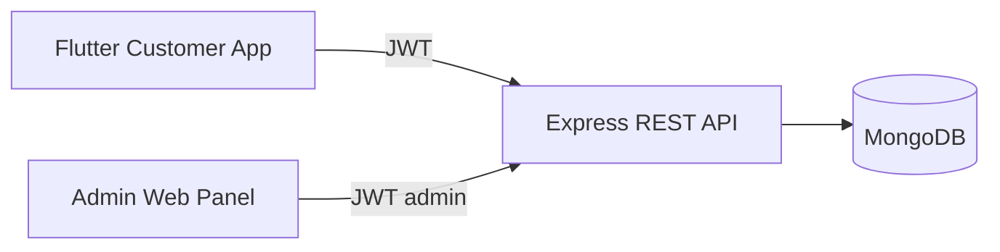

# Fix-N-Go Architecture

## Overview

Fix-N-Go is a monorepo for on-demand mobile device repair booking.

## Components

### Backend (`fixngo/backend`)

- **Express** HTTP server with JWT authentication
- **Mongoose** models: `User`, `Order`, `Service`, `Technician`
- **Catalog** endpoint merges static brands with service pricing from DB
- **Admin routes** protected by `role === 'admin'`
- Serves admin static files at `/admin`

### Customer app (`fixngo/apps/customer_app`)

- Single Flutter codebase with screen-based navigation
- `ApiService` + `SharedPreferences` for API and session persistence
- Booking flow: login → home → brand/model → issues → find tech → confirm → orders

### Admin panel (`fixngo/apps/admin_panel/public`)

- Vanilla HTML/CSS/JS dashboard
- Login, stats, order status updates, user list

## Data model

- **User**: customer, technician, or admin role
- **Order**: linked to user; stores device, issues, total, technician name, status
- **Service**: repair catalog (price list)
- **Technician**: available field technicians for assignment display

## Deployment notes

- Set `MONGO_URI`, `JWT_SECRET`, and `PORT` in production `.env`
- Point Flutter `ApiConfig.baseUrl` to your deployed API host
- Use HTTPS and strong secrets in production
